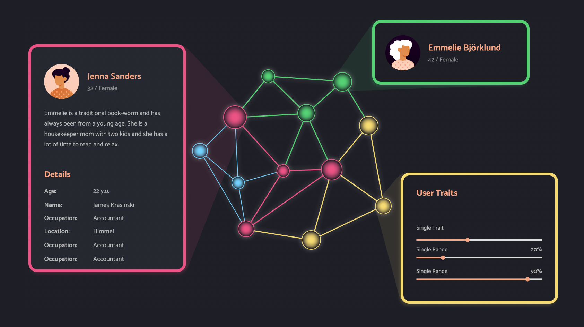

# LINCD.js
<span style="color:gray; font-size:1.3rem">**L**inked **IN**teropeable **C**ode & **D**ata</span>
### **All the tools you need to build [Linked Data](https://www.w3.org/standards/semanticweb/data) applications with ease in one package**

With [Linked Components](#ui-components-built-for-linked-data) you can rapidly prototype an interface powered by Linked Data.

To our knowledge, LINCD.js is the _only_ linked data library that supports you all the way to the UI layer.

> New to Linked Data? It is a [W3C standard](https://www.w3.org/standards/semanticweb/data) based on [RDF](https://www.w3.org/RDF/) used to build interconnected knowledge graphs. It is also known
> as [Structured Data](https://developers.google.com/search/docs/appearance/structured-data/intro-structured-data) which can
> help search engines to present rich snippets in search results.

## LINCD offers:

- [UI Components for Linked Data](#ui-components-built-for-linked-data)
- [Automatic data validation](#automatic-data-validation)
- [Automatic data loading](#automatic-data-loading)
- [OO classes for SHACL Shapes](#shapes)
- [An in-memory RDF Graph database with intuitive API](#in-memory-rdf-graph-database)
- [A registry of plug & play UI components, shapes & ontologies](https://www.lincd.org)

LINCD.js is compatible with [RDFJS task force spec](https://github.com/rdfjs/data-model-spec)

See also
- [documentation](https://docs.lincd.org)
- [examples](https://lincd.org/examples)
- [registry](https://lincd.org)

## Why?

LINCD is built from the ground up with a modern tech stack and integrates the latest developments.
This allows us to offer advanced features that go beyond other existing [RDF JavaScript libraries](https://rdf.js.org/).
Whilst also offering solutions for some major challenges in the world of Linked Data:

### Making Linked Data app development easy

Graph databases are [being](https://business-of-data.com/articles/graph-databases/) [adopted](https://www.techtarget.com/searchbusinessanalytics/news/252507769/Gartner-predicts-exponential-growth-of-graph-technology) [everywhere](https://www.computerweekly.com/news/252524802/How-graph-technology-is-making-a-dent-in-the-database-market). Tons of [Open Linked Data](https://lod-cloud.net/) is being published.
Tools have matured, but the learning curve for developers is still steep.

LINCD significantly reduces the amount of learning required and makes it _much_ easier to work with Linked Data.

### Reusable code for Linked Data

There are tons of ontologies (reusable linked data structures) available. But without a good searchable registry, it's hard to find the right one. And starting to use a specific ontology can be time-consuming still.
Reusable UI components built specifically for Linked Data are virtually non-existent. 

[LINCD.org](www.lincd.org) offers an open registry of quality ontologies and UI components built for those ontologies. Each of these ontology and components can be imported and used with just a few lines of code. 
This library make it easy to develop and share such ontologies and components in the registry.

### Solving data validation & more

Another hurdle in the adoption of Linked Data has been the openness of the RDF model.
With a lack of proper data restriction and data validation tools, maintaining a clean dataset in real life applications
has been a challenge.
W3C has since published [SHACL](https://www.w3.org/TR/shacl/), which is an excellent standard to tackle this. However,
the tools to work with SHACL have been minimal.

LINCD goes full in on SHACL and places SHACL's data "Shapes" right at the center of development. This creates much
simpler and cleaner code, frees developers up from thinking about which classes & properties to use and allows us to
offer advanced features like automatic data loading and data validation that to our knowledge no other Linked Data library or framework offers.

## Installation
**npm + node.js**
```
npm install lincd
```
```
const lincd = require("lincd");
```


See [this tutorial](https://docs.lincd.org/docs/category/tutorial---linked-data) on how to build linked data applications with LINCD.js

## UI Components built for Linked Data
UI components run on data. In a typical development environment, the component simply takes low level data like `strings`,`numbers` and `booleans` as variables or 'props' (in React).
The developer is usually responsible for obtaining this data from a database, and then manually providing the right data to each prop/variable of the component.

But with Linked Data we can _reuse_ data structures. So what if we had components that _consume_ these reusable data structures?
All the developer has to do then, is to obtain data with the right structure, and hand it to the component.

That is exactly what we've made possible with LINCD!



### Components consuming Shapes
LINCD introduces the concept of Linked Components.
These are UI components that get linked to a specific Shape.
The shape informs the structure of the data that the component expects to receive.

Here is a simple example of a functional component:

> Note: Currently LINCD exclusively supports React components, though other libraries may be added in the future.

```tsx
import {Person} from 'lincd-foaf/lib/shapes/Person';
export const PersonView = linkedComponent<Person>(Person, ({source}) => {
  //sourceShape is an instance of Person
  let person = source;
  //get the name of the person from the graph through the Person shape
  return <h1>Hello {person.name}!</h1>;
});
```

This component can then be used by providing an instance of the Person shape as it's source (using the 'of' property): 

```tsx
let person = new Person();
person.name = 'René';
return <PersonView of={person} />;
```


Linking a component (like `PersonView` defined above) [to a specific data structure](https://docs.lincd.org/docs/guides/linked-code/components#linking-a-component-to-structured-data) (in this case the shape `Person`) gives it several great benefits:

### Automatic data loading
LINCD.js can connect to any number of triple stores and/or graph databases.
All the data you request in your component will be automatically loaded from the right place and will be available when your component runs.

In the example above, all the data is already available locally, since the person was created right there.

But consider this example:
```tsx
let person = new Person('http://www.example.com/#me');
return <PersonView of={person} />;
```

Here we create a `Person` instance for the `NamedNode` with URI `http://www.example.com/#me`.
The data for this node (like the name of the person) may not be loaded yet.
So LINCD will automatically query the right store for this data and only continue to render `PersonView` when the data is loaded

### Automatic data validation
Once you have linked your component to specific shapes (data structures), LINCD.js ensures that _only those nodes_ in the graph that match with this shape will be allowed to be used with this component.
Because of this, you can rest assured that all the data will be there and in the right format.

That is, in the example above, `PersonView` will only render once LINCD has confirmed that the provided `person` instance is a valid instance of the `Person` shape. With the `Person` example [later on this page](#definition), this would mean it has exactly one name defined under `person.name` and `person.knows` returns a set of valid `Person` instances. 


### Automatic re-rendering whenever the graph changes
Linked Components automatically rerender whenever their data source updates a relevant property in the graph.

Consider this example:
```tsx
let person = new Person();
person.name = 'René';
setTimeOut(() => {
  person.name = 'Joe';
},1000);
return <PersonView of={person} />;
```

In this example, when the persons name gets updated after 1 second, `PersonView` will automatically rerender to update the displayed name.

## Shapes
LINCD introduces Shape classes that generate SHACL Shapes.

These classes enable automatic data validation and abstract away RDF implementation details.

Consider this example shape:

#### Definition
```typescript
@linkedShape
export class Person extends Shape {
 /**
  * indicates that instances of this shape need to have this rdf.type
  */
  static targetClass: NamedNode = foaf.Person;

 /**
  * instances of this person shape are REQUIRED to have exactly one foaf.name property
  */
  @literalProperty({
    path: foaf.name,
    required: true,
    maxCount: 1,
  })
  get name() {
    return this.getValue(foaf.name);
  }
  set name(val: string) {
    this.overwrite(foaf.name, new Literal(val));
  }

  /**
   * values of the property foaf.knows needs to be valid instances of this Person shape as well
   */
  @objectProperty({
    path: foaf.knows,
    shape: Person,
  })
  get knows(): ShapeSet<Person> {
    return Person.getSetOf(this.getAll(foaf.knows));
  }
}
```

#### Usage

Now when we use the shape above, we can simply use plain and simple object-oriented code. 
The code below creates RDF triples in the graph, but it ***does not need to know about any specific RDF properties or classes*** to use.

Instead, it simply uses the accessors from the Shape.

Furthermore, the shape class allows us to validate our graph. This happens automatically when visualising specific shapes from the graph with [Linked Components](#ui-components-built-for-linked-data)

```typescript
let person = new Person();
person.name = "Rene";

let person2 = new Person();
person2.name = "Jenny";

person.knows.add(person2);

//both persons are valid instances of Person
console.log(Person.validate(person)); //true
console.log(Person.validate(person2));//true
```


## In-memory RDF Graph Database
**With an intuitive resource-centric API:**

In *other RDF libraries* you will have to work with raw triples / quads.
Creating triples or quads or searching your graph requires you to think in terms of `subject,predicate,object,graph`.

However, [a triple](https://en.wikipedia.org/wiki/Semantic_triple) is simply a subject node that has points to (the predicate or 'edge') another node.
LINCD instead lets you think of your graph as nodes (subjects) that have _values_ (the objects) for certain _properties_ (the predicates).

In other words, you can simply **update & search your graph from any node**, by setting/getting properties.

Here's some examples:
### Setting properties
```typescript
let person = NamedNode.getOrCreate("http://ex.org/person");
let person2 = NamedNode.getOrCreate("http://ex.org/person2");
person.set(foaf.name,new Literal("John Doe"));
person2.set(foaf.name,new Literal("Jane"));
person.set(foaf.knows,person2);
```
This results in the following triples
```turtle
<http://ex.org/person> foaf:name "John Doe"
<http://ex.org/person> foaf:knows <http://ex.org/person2>
```

### Searching the graph
Methods like `getAll(property)` and `getOne(property)` and `getValues(property)` all return sets of values.
These sets in turn have the same methods, to get properties of all the nodes in the set.

For example, to obtain the names of the persons that a person knows:

```typescript
//a Set of Literals
person.getAll(foaf.knows).getAll(foaf.name);
```

Alternatively you can also go straight to the literal value:

```typescript
//["name1","name2"]..
console.log(person.getAll(foaf.knows).getValues(foaf.name));
```

### Removing properties
To remove triples from the graph, simply unset the properties

```typescript
//overwrite all previous values of a property, the person will now ONLY know person3
person.overwrite(foaf.knows,person3);

//remove 1 specific connection in the graph
person.unset(foaf.knows,person3);

//remove all connections of a certain property
property.unsetAll(foaf.knows);
```

[//]: # (```tsx)
[//]: # (//pseudo example of how to search the graph in OTHER LIBRARIES )
[//]: # (let person = namedNode&#40;'http://ex.org/person'&#41;;)
[//]: # (let knows = namedNode&#40;'http://xmlns.com/foaf/0.1/knows'&#41;;)
[//]: # (let label = namedNode&#40;'http://www.w3.org/1999/02/22-rdf-syntax-ns#'&#41;;)
[//]: # (let labels = [];)
[//]: # (for &#40;quad of store.match&#40;person,knows&#41;&#41; {)
[//]: # (  for &#40;quad2 of store.match&#40;quad.subject,label&#41;&#41; {)
[//]: # (    labels.push&#40;quad2.object&#41;;)
[//]: # (  })
[//]: # (})
[//]: # (```)

## A registry of reusable UI components, Shapes & ontologies

[lincd.org](https://www.lincd.org/) is a registry of components, shapes and ontologies built with lincd.js. Each of these can be imported and used with a few lines. This is the best place to get started to build an application powered by linked data.  


## Documentation
See [docs.lincd.org](https://docs.lincd.org) for the full documentation plus helpful tutorials for lincd.js 

## Examples
See [lincd.org/examples](https://lincd.org/examples) for a list of examples with source code on github.

[//]: # (## About LINCD)

[//]: # ()
[//]: # (Even today, most projects use their own data structures, thus creating data silos.)

[//]: # (Projects that want to share data need understand each others APIs to extract the right data, and then convert that data)

[//]: # (using custom code.)

[//]: # ()
[//]: # (![]&#40;assets/lincd-slide.png&#41;)

[//]: # ()
[//]: # (LINCD aims to remove these barriers to collaboration and interoperability by creating a place where projects can)

[//]: # (collectively define shared data structures and shared code.)

[//]: # ()
[//]: # (## About LINCD.js)

[//]: # ()
[//]: # (`LINCD.js` is a lightweight Javascript library that implements the [LINCD protocol]&#40;https://www.lincd.org&#41;.)

[//]: # ()
[//]: # (With the help of modules built with `lincd.js` you can integrate data from different sources and build visualizations)

[//]: # (with ease.)

[//]: # ()
[//]: # (### Main Library Features)

[//]: # ()
[//]: # (- Convert your data to Linked Data and validated [SHACL Shapes]&#40;https://www.w3.org/TR/shacl/#shapes&#41; with ease)

[//]: # (- Access the in-memory graph database with an accessible resource-centric API.)

[//]: # (- Observe changes in the graph with the built-in event system)

[//]: # (- Abstract away ontologies & RDF specifics in Shape Classes)

[//]: # (- Create interface components based on Shape Classes, which abstracts away ontology details from the UI layer)

[//]: # (- Compatible with [RDFJS task force spec]&#40;https://github.com/rdfjs/data-model-spec&#41;)

[//]: # ()
[//]: # (### Examples & documentation)

[//]: # ()
[//]: # (Are currently actively developed.)

[//]: # ([Signup here]&#40;http://eepurl.com/hVBG0n&#41; to be notified as LINCD is launching)

[//]: #

[//]: # '## Examples'

[//]: #

[//]: #

[//]: # '## Documentation'

[//]: #

[//]: # '- Consuming a LINCD components'

[//]: #

[//]: #

[//]: # '### Building your own LINCD Modules'

[//]: #

[//]: #

[//]: # 'With LINCD.js, you can link code to [SHACL Shapes](https://www.w3.org/TR/shacl/#shapes). '

[//]: #

[//]: #

[//]: # 'By doing so, you make your code easily applicable to anyone who structures their data with these Shapes.'

[//]: #

[//]: #

[//]: # "Modules built with LINCD.js can be published to the LINCD repository (with `npm run publish`) which makes your module and it's required data Shapes easy to find and use.  "

[//]: #

[//]: #

[//]: # 'See the documentation '

[//]: #

[//]: #

[//]: # '---'

[//]: #

[//]: # 'Create and share code modules across different environments using W3C’s Linked Data standards.'

[//]: #

[//]: #

[//]: #

[//]: #

[//]: #

[//]: # '- Link your code to SHACL Shapes'

[//]: #

[//]: # '- '

[//]: #

[//]: # '- '

[//]: #

[//]: #

[//]: # '    Reads and writes RDF/XML, Turtle and N3; Reads RDFa and JSON-LD'

[//]: #

[//]: # '    Read/Write Linked Data client, using WebDav or SPARQL/Update'

[//]: #

[//]: # '    Real-Time Collaborative editing with web sockets and PATCHes'

[//]: #

[//]: # '    Local API for querying a store'

[//]: #

[//]: # '    Compatible with RDFJS task force spec'

[//]: #

[//]: # '    SPARQL queries (not full SPARQL - just graph match and optional)'

[//]: #

[//]: # '    Smushing of nodes from owl:sameAs, and owl:{f,inverseF}unctionProperty'

[//]: #

[//]: # '    Tracks provenance of triples keeps metadata (in RDF) from HTTP accesses'

[//]: #

[//]: #

[//]: #

[//]: # '## LINCD - Linked Interoperable Code & Data'

[//]: #

[//]: # 'The LINCD Protocol specifies how '

[//]: #

[//]: #

[//]: #

[//]: # '## Installation'

[//]: #

[//]: # '```'

[//]: #

[//]: # 'npm install lincd'

[//]: #

[//]: # '```'

[//]: #

[//]: #

[//]: # '## Usage'

[//]: #

[//]: # 'Javascript'

[//]: #

[//]: # '```'

[//]: #

[//]: # 'let lincd = require("lincd")'

[//]: #

[//]: # '```'

[//]: #

[//]: #

[//]: # 'Typescript'

[//]: #

[//]: # '```'

[//]: #

[//]: # 'import lincd from "lincd"'

[//]: #

[//]: # '```'

## Contributing

To make changes to `lincd.js`, clone this repository and install dependencies with `npm install`.
Then run `npm run dev` to start the development process which watches for source file changes in `src` and automatically
updates the individual transpiled files in the `lib` _and_ the bundles in the `dist` folder.

Alternatively run `npm run build` to build the project just once.

We welcome pull requests.

[//]: # '## LICENSE'

[//]: # '[MPL v2](https://www.mozilla.org/en-US/MPL/2.0/)'
