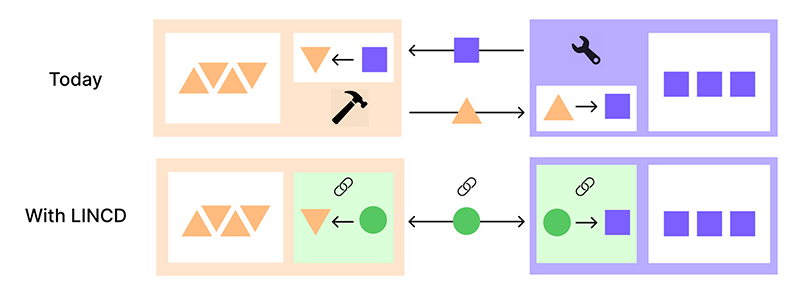

# LINCD.js

**A powerful JavaScript library that makes developing applications with [Linked Data](https://www.w3.org/standards/semanticweb/data) a
breeze**

> Linked Data is a W3C standard based on [RDF](https://www.w3.org/RDF/). It is also known
> as [Structured Data](https://developers.google.com/search/docs/appearance/structured-data/intro-structured-data) and can
> help search engines to present rich snippets in search results.

## LINCD offers:

- In-memory RDF Graph database
- Intuitive developer-friendly resource-centric API 
- Automatic data validation 
- Automatic data loading
- Obj. Oriented Classes for SHACL Shapes
- Build components without any pre-requisite RDF knowledge 
- Automatic re-rendering whenever the graph changes 
- Plug & play ontologies
- A registry of reusable UI components, Shapes & ontologies
- Compatible with [RDFJS task force spec](https://github.com/rdfjs/data-model-spec)

Each feature is further described below.

## Why?

LINCD is built from the ground up with a modern tech stack and integrates the latest developments.
This allows us to offer advanced features that go beyond other existing [RDF JavaScript libraries](https://rdf.js.org/).
Whilst also offering solutions for some major challenges in the world of Linked Data:

### Making Linked Data way easier to use

Graph databases are [being](https://business-of-data.com/articles/graph-databases/) [adopted](https://www.techtarget.com/searchbusinessanalytics/news/252507769/Gartner-predicts-exponential-growth-of-graph-technology) [everywhere](https://www.computerweekly.com/news/252524802/How-graph-technology-is-making-a-dent-in-the-database-market). Tons of [Open Linked Data](https://lod-cloud.net/) is being published.
Tools have matured, but the learning curve for developers is still steep.

LINCD significantly reduces the amount of learning required and makes it _much_ easier to work with Linked Data.

### Making code for Linked Data reusable

There are tons of ontologies (reusable linked data structures) available. But without a good searchable registry, it's hard to find the right one. And starting to use a specific ontology can be time-consuming still.
Reusable UI components built specifically for Linked Data are virtually non-existent. 

[LINCD.org](www.lincd.org) offers an open registry of quality ontologies and UI components built for those ontologies. Each of these ontology and components can be imported and used with just a few lines of code. 
This library make it easy to develop and share such ontologies and components in the registry.

### Solving data validation & more

Another hurdle in the adoption of Linked Data has been the openness of the RDF model.
With a lack of proper data restriction and data validation tools, maintaining a clean dataset in real life applications
has been a challenge.
W3C has since published [SHACL](https://www.w3.org/TR/shacl/), which is an excellent standard to tackle this. However,
the tools to work with SHACL have been minimal.

LINCD goes full in on SHACL and places SHACL's data "Shapes" right at the center of development. This creates much
simpler and cleaner code, frees developers up from thinking about which classes & properties to use and allows us to
offer advanced features (like automatic data loading) that to our knowledge no other Linked Data library or framework offers:

## In-memory RDF Graph Database 
### Intuitive resource-centric API

## Plug & play ontologies
## Shapes
### Object-Oriented Classes
### Plug & play
## Automatic data loading
## Automatic data validation

## UI Components built for Linked Data
without any pre-requisite RDF knowledge
### Automatic re-rendering whenever the graph changes

## A registry of reusable UI components, Shapes & ontologies


Existing libraries use [s,p,o,g] search.

## About LINCD

Even today, most projects use their own data structures, thus creating data silos.
Projects that want to share data need understand each others APIs to extract the right data, and then convert that data
using custom code.



LINCD aims to remove these barriers to collaboration and interoperability by creating a place where projects can
collectively define shared data structures and shared code.

## About LINCD.js

`LINCD.js` is a lightweight Javascript library that implements the [LINCD protocol](https://www.lincd.org).

With the help of modules built with `lincd.js` you can integrate data from different sources and build visualizations
with ease.

### Main Library Features

- Convert your data to Linked Data and validated [SHACL Shapes](https://www.w3.org/TR/shacl/#shapes) with ease
- Access the in-memory graph database with an accessible resource-centric API.
- Observe changes in the graph with the built-in event system
- Abstract away ontologies & RDF specifics in Shape Classes
- Create interface components based on Shape Classes, which abstracts away ontology details from the UI layer
- Compatible with [RDFJS task force spec](https://github.com/rdfjs/data-model-spec)

### Examples & documentation

Are currently actively developed.
[Signup here](http://eepurl.com/hVBG0n) to be notified as LINCD is launching

[//]: #

[//]: # '## Examples'

[//]: #

[//]: #

[//]: # '## Documentation'

[//]: #

[//]: # '- Consuming a LINCD components'

[//]: #

[//]: #

[//]: # '### Building your own LINCD Modules'

[//]: #

[//]: #

[//]: # 'With LINCD.js, you can link code to [SHACL Shapes](https://www.w3.org/TR/shacl/#shapes). '

[//]: #

[//]: #

[//]: # 'By doing so, you make your code easily applicable to anyone who structures their data with these Shapes.'

[//]: #

[//]: #

[//]: # "Modules built with LINCD.js can be published to the LINCD repository (with `npm run publish`) which makes your module and it's required data Shapes easy to find and use.  "

[//]: #

[//]: #

[//]: # 'See the documentation '

[//]: #

[//]: #

[//]: # '---'

[//]: #

[//]: # 'Create and share code modules across different environments using W3C’s Linked Data standards.'

[//]: #

[//]: #

[//]: #

[//]: #

[//]: #

[//]: # '- Link your code to SHACL Shapes'

[//]: #

[//]: # '- '

[//]: #

[//]: # '- '

[//]: #

[//]: #

[//]: # '    Reads and writes RDF/XML, Turtle and N3; Reads RDFa and JSON-LD'

[//]: #

[//]: # '    Read/Write Linked Data client, using WebDav or SPARQL/Update'

[//]: #

[//]: # '    Real-Time Collaborative editing with web sockets and PATCHes'

[//]: #

[//]: # '    Local API for querying a store'

[//]: #

[//]: # '    Compatible with RDFJS task force spec'

[//]: #

[//]: # '    SPARQL queries (not full SPARQL - just graph match and optional)'

[//]: #

[//]: # '    Smushing of nodes from owl:sameAs, and owl:{f,inverseF}unctionProperty'

[//]: #

[//]: # '    Tracks provenance of triples keeps metadata (in RDF) from HTTP accesses'

[//]: #

[//]: #

[//]: #

[//]: # '## LINCD - Linked Interoperable Code & Data'

[//]: #

[//]: # 'The LINCD Protocol specifies how '

[//]: #

[//]: #

[//]: #

[//]: # '## Installation'

[//]: #

[//]: # '```'

[//]: #

[//]: # 'npm install lincd'

[//]: #

[//]: # '```'

[//]: #

[//]: #

[//]: # '## Usage'

[//]: #

[//]: # 'Javascript'

[//]: #

[//]: # '```'

[//]: #

[//]: # 'let lincd = require("lincd")'

[//]: #

[//]: # '```'

[//]: #

[//]: #

[//]: # 'Typescript'

[//]: #

[//]: # '```'

[//]: #

[//]: # 'import lincd from "lincd"'

[//]: #

[//]: # '```'

## Contributing

To make changes to `lincd.js`, clone this repository and install dependencies with `npm install`.
Then run `npm run dev` to start the development process which watches for source file changes in `src` and automatically
updates the individual transpiled files in the `lib` _and_ the bundles in the `dist` folder.

Alternatively run `npm run build` to build the project just once.

We welcome pull requests.

[//]: # '## LICENSE'

[//]: # '[MPL v2](https://www.mozilla.org/en-US/MPL/2.0/)'
